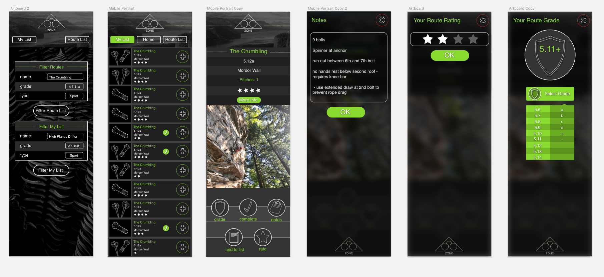
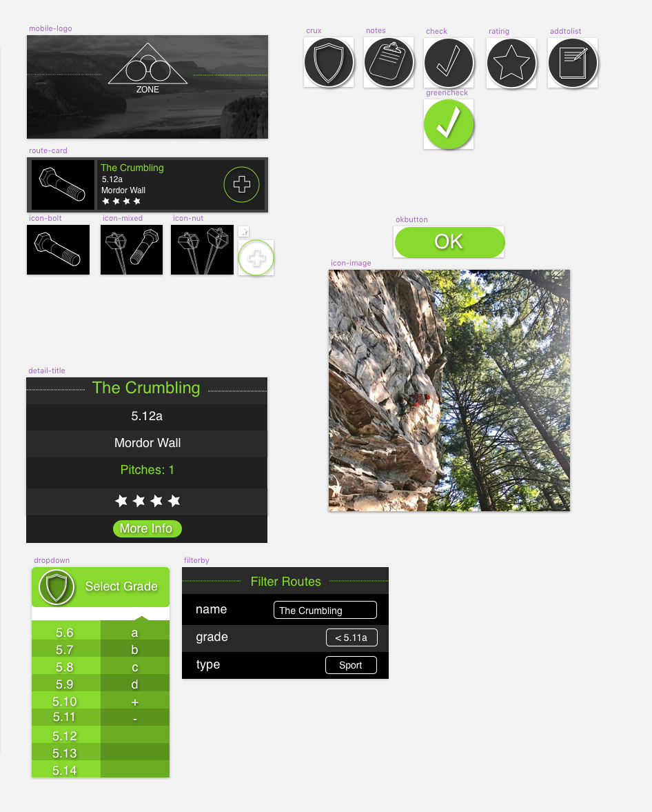

# Ozone

#### A brief program description

An rock climbing diary for the Ozone climbing crag in Washougal, Washington.

Code is located in "ozone" directory.

#### By _**Ted Leary**_

#### Progress at - 7/13/18

* CSS writeup refactored into css-modules syntax.
* API call is made in index.js
* two reducers receiving separate action types implemented to be combined and returned as state
* JSON info from call populates List component
* Detail component populated dynamically with information from list (props sent through router link)
* Detail component 'more info' button links out to mountainproject's info page on selected route
* Add to List button pushes route object to 'myList' state slice

## Description

This app will populate a list of routes at Ozone using Mountainproject.com's API. Users will be able to search the main list to populate their own personal list with routes they are interested in. Users can then grade, rate, check-off-as-completed or add notes to specific routes.

## Sketch Wireframe

## Setup/Installation Requirements

* Install program by cloning this repository.
* run $npm Install
* $npm run start to launch dev server.

## Known Bugs

N/A

## Support and contact details

For Support, contact:
N/A

## Technologies Used

* HTML
* CSS
* JavaScript
* React.JS
* Node
* Webpack

### License

This software is licensed under the MIT license.

Permission is hereby granted, free of charge, to any person obtaining a copy of this software and associated documentation files (the "Software"), to deal in the Software without restriction, including without limitation the rights to use, copy, modify, merge, publish, distribute, sublicense, and/or sell copies of the Software, and to permit persons to whom the Software is furnished to do so, subject to the following conditions:

The copyright notice and this permission notice shall be included in all copies or substantial portions of the Software.

THE SOFTWARE IS PROVIDED "AS IS", WITHOUT WARRANTY OF ANY KIND, EXPRESS OR IMPLIED, INCLUDING BUT NOT LIMITED TO THE WARRANTIES OF MERCHANTABILITY, FITNESS FOR A PARTICULAR PURPOSE AND NONINFRINGEMENT. IN NO EVENT SHALL THE AUTHORS OR COPYRIGHT HOLDERS BE LIABLE FOR ANY CLAIM, DAMAGES OR OTHER LIABILITY, WHETHER IN AN ACTION OF CONTRACT, TORT OR OTHERWISE, ARISING FROM, OUT OF OR IN CONNECTION WITH THE SOFTWARE OR THE USE OR OTHER DEALINGS IN THE SOFTWARE.

Copyright (c) 2018 **Ted Leary**
